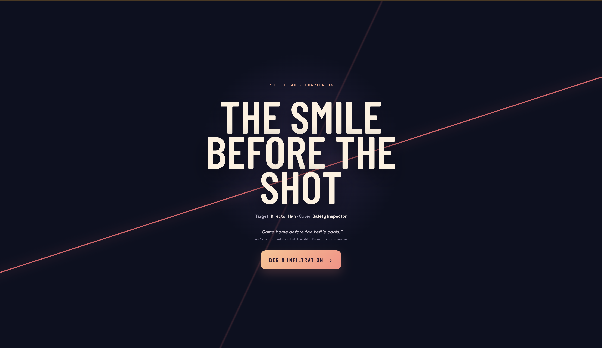
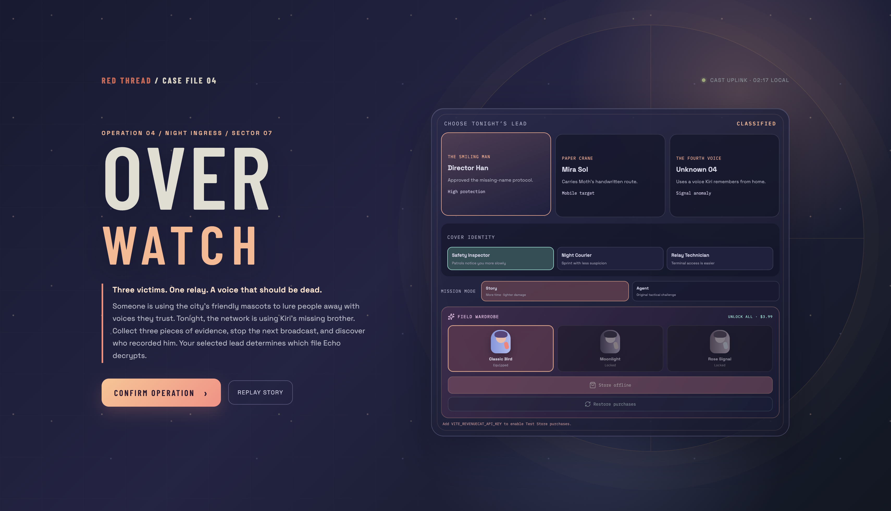
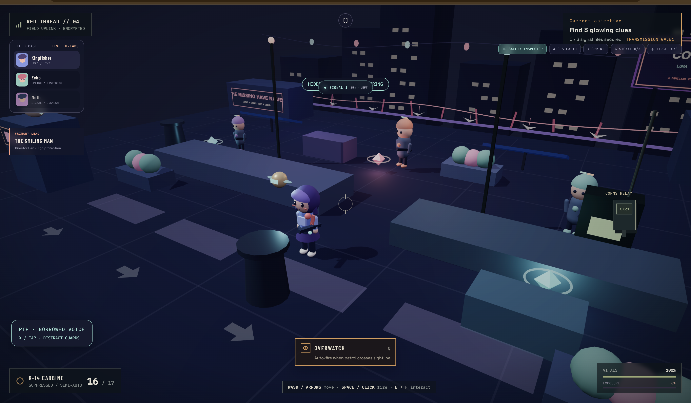
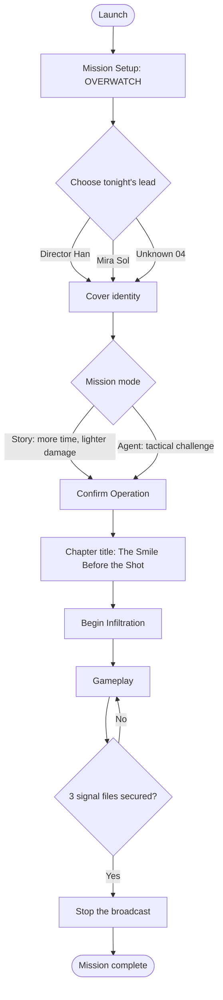
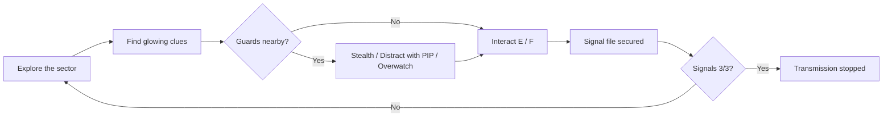
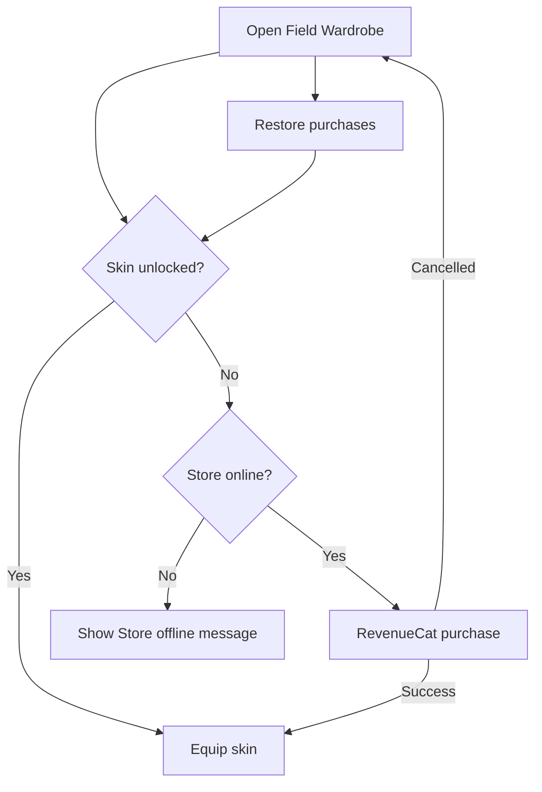

# RED THREAD // OVERWATCH

> *Three victims. One relay. A voice that should be dead.*

Chapter 04 of **RED THREAD**: an infiltration mission where you pick a lead, choose a cover identity, and collect three pieces of evidence to stop the next broadcast. Built for the RevenueCat Shipaton 2026.

---

## Screenshots

| Chapter intro | Mission setup | Gameplay |
|---|---|---|
|  |  |  |

---

## Game Flow



## Gameplay Loop



## Store / Wardrobe Flow (RevenueCat)



---

## Controls

| Key | Action |
|---|---|
| WASD / Arrows | Move |
| Space / Click | Fire |
| E / F | Interact |
| C | Stealth |
| Q | Overwatch |
| X / Tap | PIP: distract guards |

## Setup

```bash
git clone https://github.com/eemanefatimaawan567-glitch/Red-Thread-Over-Watch.git
cd Red-Thread-Over-Watch
npm install
```

Create a `.env` file in the project root:

```
VITE_REVENUECAT_API_KEY=your_revenuecat_public_sdk_key
```

Then run:

```bash
npm run dev
```

Without the key the store runs offline and purchasable skins stay locked.

## Tech

- Vite web app
- RevenueCat SDK for in-app purchases (Unlock All, Restore purchases)

## Author

Eeman e Fatima Awan, Institute of Space Technology (IST)
